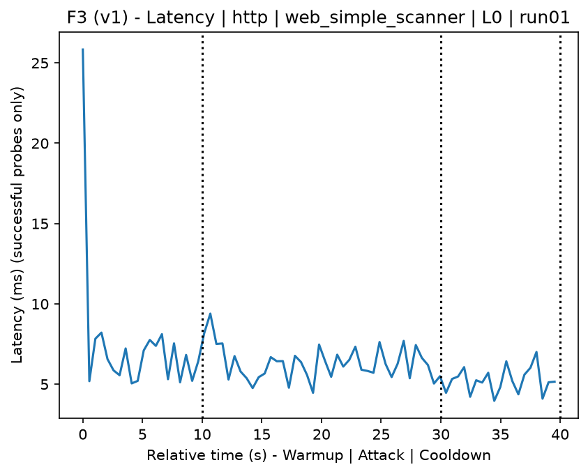
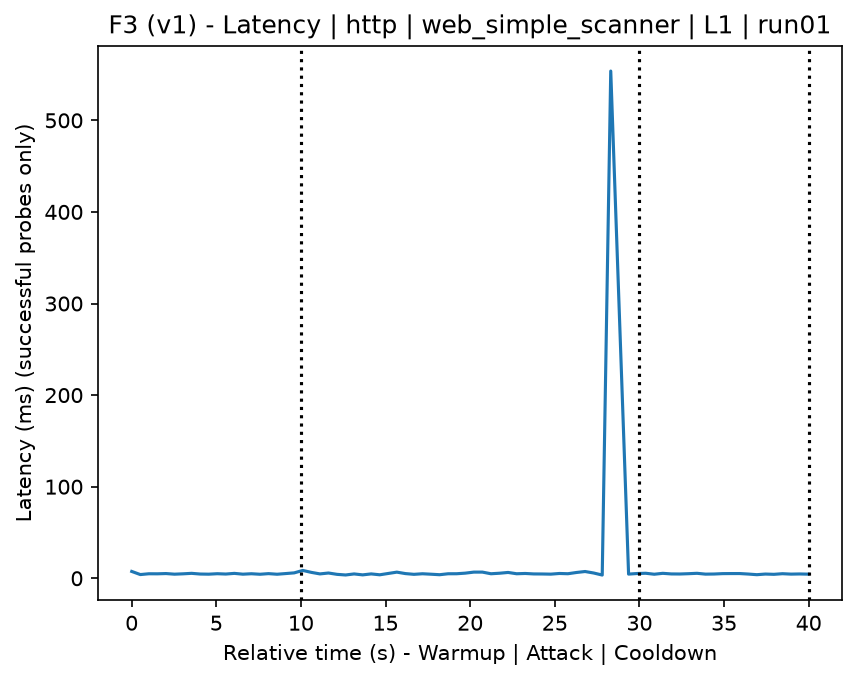
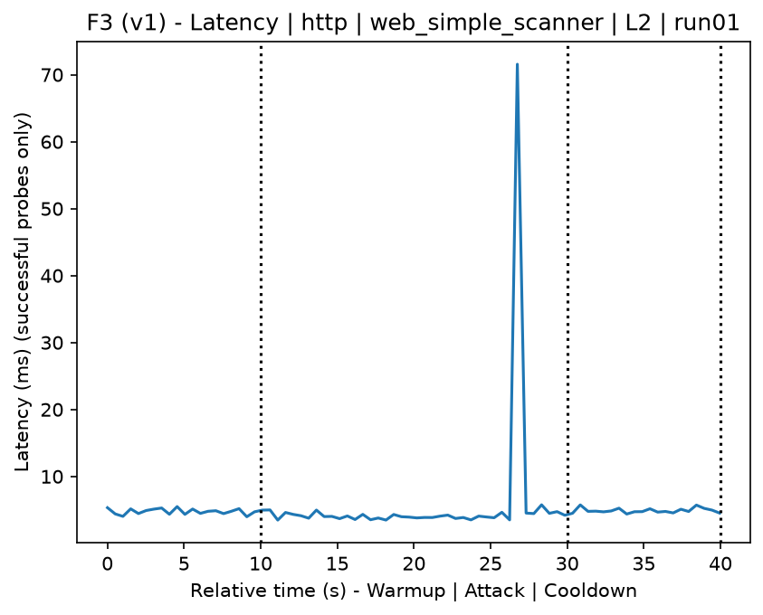
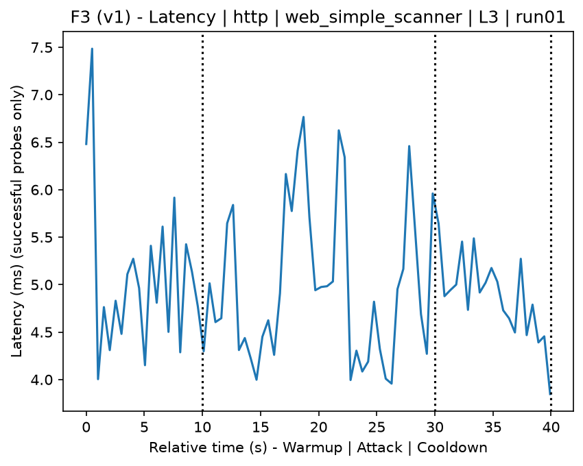
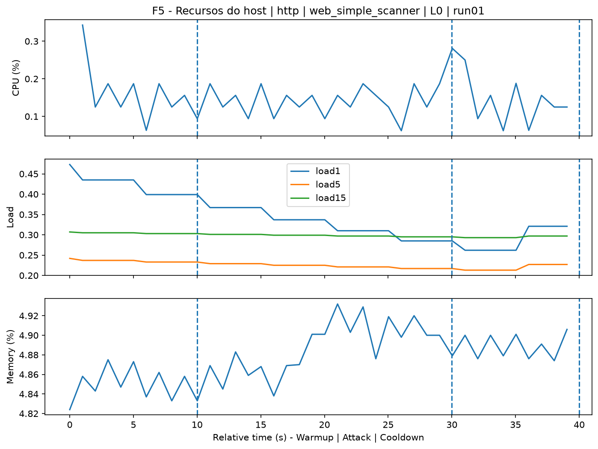
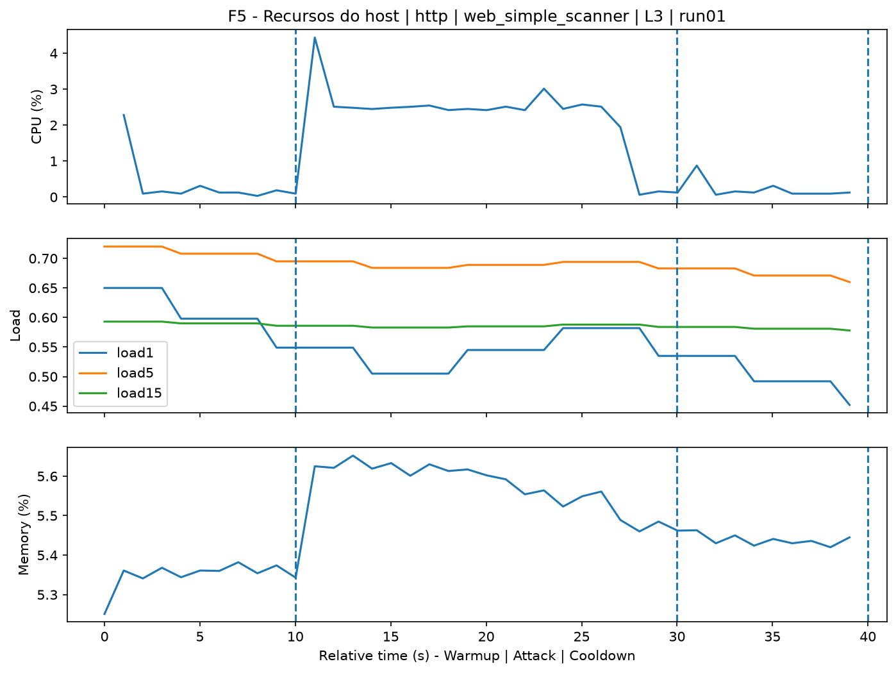
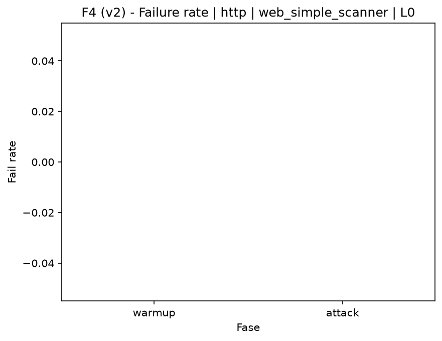

# Web Simple Scanner (`web_simple_scanner`)

[Índice da campanha](README.md)

Na campanha `experiments/60att_5runs_l0l1l2l3`, este documento consolida a execução do ataque `web_simple_scanner`. No catálogo local, o ataque é descrito como: Simplified scanner for known web vulnerabilities. A documentação abaixo usa apenas artefatos já presentes no repositório, principalmente as tabelas e figuras de `experiments/60att_5runs_l0l1l2l3/web_simple_scanner`.

## Metadados do ataque

| Campo | Valor |
| --- | --- |
| ID | `web_simple_scanner` |
| Categoria | 3) Web Application Attacks |
| Subcategoria | 3.1 General Web |
| Serviços alvo | http-server |
| Imagem | `attack-web-simple-scanner:latest` |
| Container | `attack-web-simple-scanner` |
| Runtime máximo do catálogo | 10 s |
| Parâmetros de intensidade | n/d |
| MITRE ATT&CK | [https://attack.mitre.org/tactics/TA0043/](https://attack.mitre.org/tactics/TA0043/) [https://attack.mitre.org/techniques/T1592/](https://attack.mitre.org/techniques/T1592/) [https://attack.mitre.org/techniques/T1595/](https://attack.mitre.org/techniques/T1595/) [https://attack.mitre.org/techniques/T1595/002/](https://attack.mitre.org/techniques/T1595/002/) |

## Resumo estatístico por nível

| Nível | Serviço | Runs | Amostras attack | Sucesso médio | Falha média | Lat p50/p95 ms | PCAP total MB | Dataset médio (min-max) | Exec média s | Extratores ok/total | CPU média/máx | Mem MB média |
| --- | --- | --- | --- | --- | --- | --- | --- | --- | --- | --- | --- | --- |
| L0 | http | 5 | 200 | 100% | 0% | 5,34 / 6,89 | 1,66 | 3.144 (3.120-3.160) | 42,31 | 3/3 | 0,8% / 1,01% | 971,99 |
| L1 | http | 5 | 199 | 100% | 0% | 4,35 / 5,81 | 93,69 | 99.088 (99.084-99.098) | 56,48 | 3/3 | 11,88% / 17,73% | 953,63 |
| L2 | http | 5 | 197 | 100% | 0% | 4,35 / 5,77 | 93,68 | 99.069 (99.006-99.086) | 56,55 | 3/3 | 11,82% / 17,01% | 908,77 |
| L3 | http | 5 | 200 | 100% | 0% | 4,56 / 5,79 | 93,69 | 99.086 (99.084-99.092) | 56,29 | 3/3 | 12,16% / 17,22% | 885,14 |

## Estabilidade entre reexecuções

| Nível | Métrica | Runs | Média | Desvio | CV | Min | Max |
| --- | --- | --- | --- | --- | --- | --- | --- |
| L0 | CPU média na fase attack | 5 | 0,8 | 0,09 | 10,83% | 0,74 | 0,94 |
| L0 | Linhas do dataset | 5 | 3.144 | 21,91 | 0,7% | 3.120 | 3.160 |
| L0 | Tempo de execução | 5 | 42,31 | 0,41 | 0,96% | 42,08 | 43,03 |
| L0 | Falha na fase attack | 5 | 0 | 0 | n/d | 0 | 0 |
| L0 | Latência p95 censurada | 5 | 6,89 | 0,78 | 11,32% | 5,87 | 7,72 |
| L1 | CPU média na fase attack | 5 | 11,88 | 0,55 | 4,63% | 11,58 | 12,86 |
| L1 | Linhas do dataset | 5 | 99.088 | 5,83 | 0,01% | 99.084 | 99.098 |
| L1 | Tempo de execução | 5 | 56,48 | 0,12 | 0,21% | 56,33 | 56,65 |
| L1 | Falha na fase attack | 5 | 0 | 0 | n/d | 0 | 0 |
| L1 | Latência p95 censurada | 5 | 5,81 | 0,97 | 16,76% | 5,06 | 7,5 |
| L2 | CPU média na fase attack | 5 | 11,82 | 0,38 | 3,23% | 11,39 | 12,28 |
| L2 | Linhas do dataset | 5 | 99.069,2 | 35,34 | 0,04% | 99.006 | 99.086 |
| L2 | Tempo de execução | 5 | 56,55 | 0,38 | 0,68% | 56,24 | 57,2 |
| L2 | Falha na fase attack | 5 | 0 | 0 | n/d | 0 | 0 |
| L2 | Latência p95 censurada | 5 | 5,77 | 0,69 | 11,93% | 5,03 | 6,73 |
| L3 | CPU média na fase attack | 5 | 12,16 | 0,21 | 1,71% | 11,82 | 12,38 |
| L3 | Linhas do dataset | 5 | 99.086 | 3,46 | 0% | 99.084 | 99.092 |
| L3 | Tempo de execução | 5 | 56,29 | 0,1 | 0,19% | 56,22 | 56,48 |
| L3 | Falha na fase attack | 5 | 0 | 0 | n/d | 0 | 0 |
| L3 | Latência p95 censurada | 5 | 5,79 | 0,54 | 9,28% | 5,22 | 6,47 |

## Validação de artefatos

| Nível | Runs | Captura | Probe | Features | Dataset | Recursos | Server stats | Aceite |
| --- | --- | --- | --- | --- | --- | --- | --- | --- |
| L0 | 5 | 5/5 | 5/5 | 5/5 | 5/5 | 5/5 | 5/5 | 5/5 |
| L1 | 5 | 5/5 | 5/5 | 5/5 | 5/5 | 5/5 | 5/5 | 5/5 |
| L2 | 5 | 5/5 | 5/5 | 5/5 | 5/5 | 5/5 | 5/5 | 5/5 |
| L3 | 5 | 5/5 | 5/5 | 5/5 | 5/5 | 5/5 | 5/5 | 5/5 |

## Figuras selecionadas

<table>
<tr>
<td> Série temporal L0 run01</td>
<td> Série temporal L1 run01</td>
</tr>
<tr>
<td> Série temporal L2 run01</td>
<td> Série temporal L3 run01</td>
</tr>
<tr>
<td> Recursos L0 run01</td>
<td> Recursos L3 run01</td>
</tr>
<tr>
<td> Taxa de falha L0</td>
<td> Taxa de falha L3</td>
</tr>
</table>

## Fontes utilizadas

- Catálogo do ataque: `docker/attackers/web-simple-scanner/attack.yaml`
- Artefatos da campanha: `experiments/60att_5runs_l0l1l2l3/web_simple_scanner`
