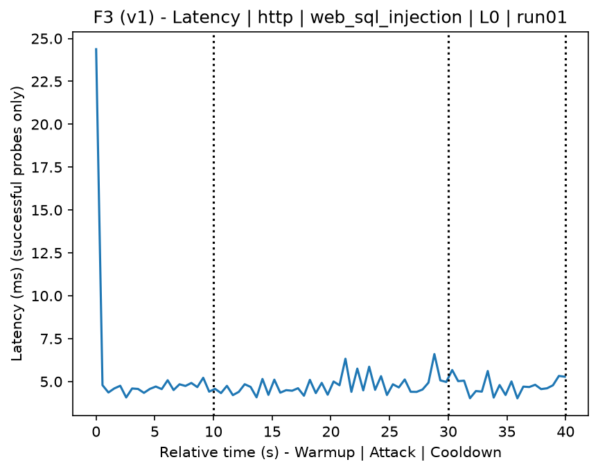
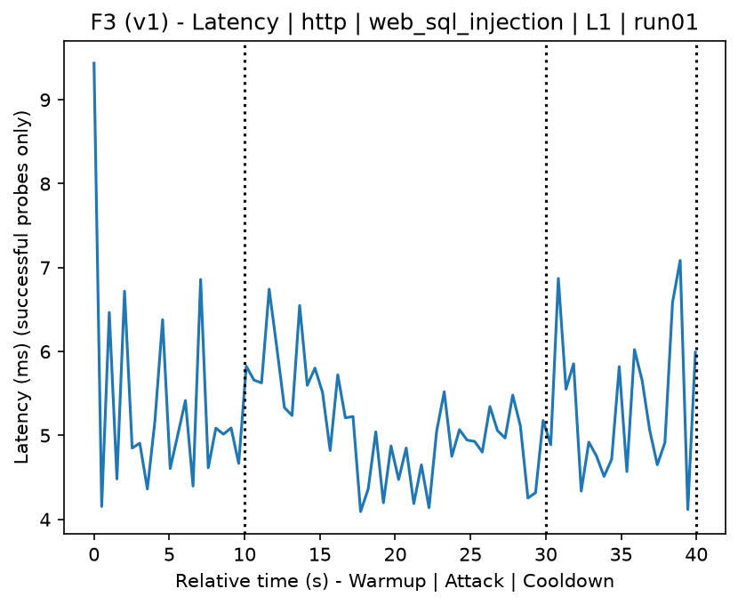
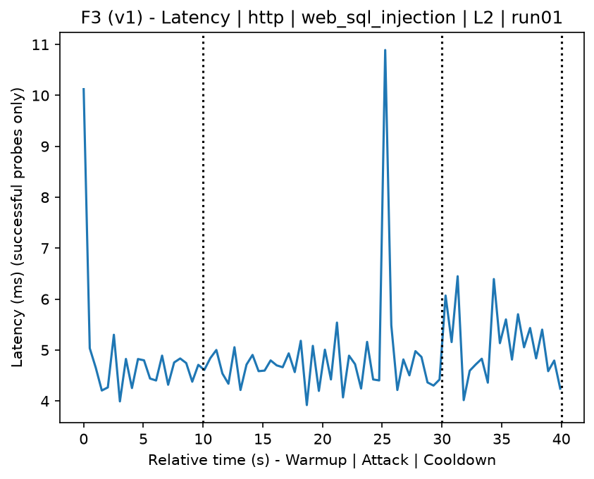
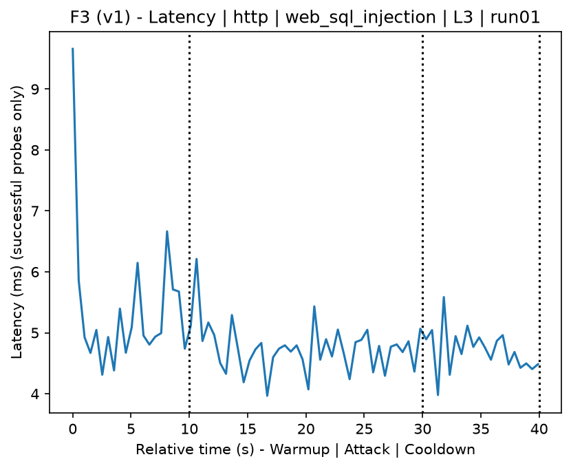
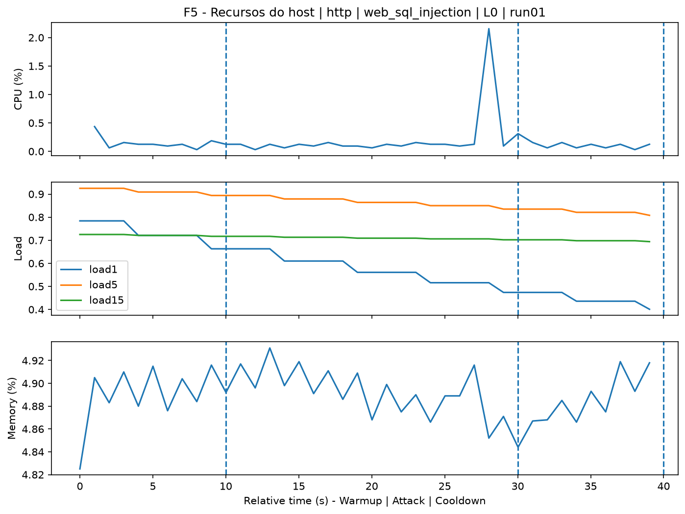
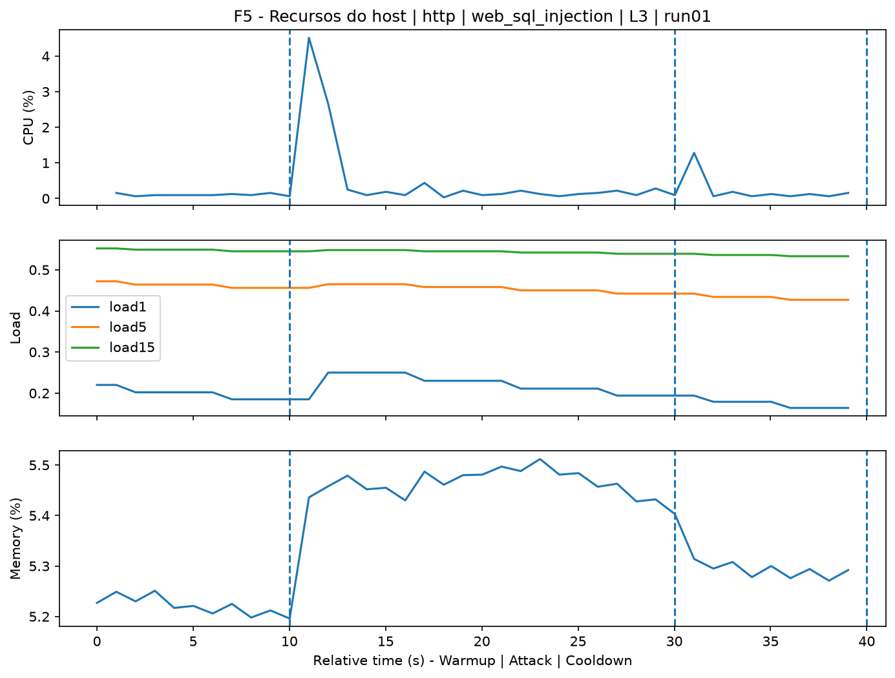
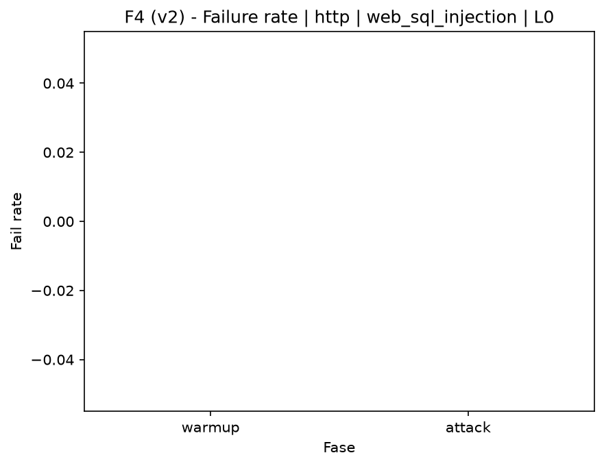

# SQL Injection (`web_sql_injection`)

[Campaign index](README.md)

This document summarizes the published campaign execution of attack `web_sql_injection`. In the local catalog, the attack is described as: SQL injection exploitation tests. The full execution artifacts are not versioned in this repository; retrieve the generated dataset CSVs from the Figshare dataset linked in the campaign index. Raw PCAP captures are not included in that archive. The selected figures below are stored under `contrib/assets/campaign_doc`.

## Attack Metadata

| Field | Value |
| --- | --- |
| ID | `web_sql_injection` |
| Category | 3) Web Application Attacks |
| Subcategory | 3.1 General Web |
| Target services | http-server |
| Image | `attack-sql-injection:latest` |
| Container | `attack-sql-injection` |
| Catalog max runtime | 10 s |
| Intensity parameters | n/a |
| MITRE ATT&CK | [https://attack.mitre.org/tactics/TA0043/](https://attack.mitre.org/tactics/TA0043/) [https://attack.mitre.org/tactics/TA0001/](https://attack.mitre.org/tactics/TA0001/) [https://attack.mitre.org/techniques/T1595/](https://attack.mitre.org/techniques/T1595/) [https://attack.mitre.org/techniques/T1595/002/](https://attack.mitre.org/techniques/T1595/002/) [https://attack.mitre.org/techniques/T1190/](https://attack.mitre.org/techniques/T1190/) |

## Statistical Summary by Level

| Level | Service | Runs | Attack samples | Mean success | Mean failure | Lat p50/p95 ms | Total PCAP MB | Mean dataset (min-max) | Mean exec s | Extractors ok/total | Mean/max CPU | Mean mem MB |
| --- | --- | --- | --- | --- | --- | --- | --- | --- | --- | --- | --- | --- |
| L0 | http | 5 | 200 | 100% | 0% | 5,24 / 6,53 | 1,66 | 3.144 (3.120-3.200) | 42,29 | 3/3 | 0,85% / 1% | 888,19 |
| L1 | http | 5 | 200 | 100% | 0% | 4,75 / 5,9 | 1,74 | 3.328 (3.324-3.332) | 42,09 | 3/3 | 0,76% / 1% | 879,14 |
| L2 | http | 5 | 200 | 100% | 0% | 4,83 / 5,96 | 1,74 | 3.319 (3.284-3.334) | 42,09 | 3/3 | 0,79% / 1,1% | 878,6 |
| L3 | http | 5 | 200 | 100% | 0% | 4,74 / 5,65 | 1,74 | 3.327 (3.324-3.330) | 42,06 | 3/3 | 0,77% / 0,98% | 879,99 |

## Stability Across Reruns

| Level | Metric | Runs | Mean | Deviation | CV | Min | Max |
| --- | --- | --- | --- | --- | --- | --- | --- |
| L0 | Mean CPU in attack phase | 5 | 0,85 | 0,13 | 15,26% | 0,7 | 1,01 |
| L0 | Dataset rows | 5 | 3.144,4 | 35,45 | 1,13% | 3.120 | 3.200 |
| L0 | Execution time | 5 | 42,29 | 0,33 | 0,78% | 42,09 | 42,87 |
| L0 | Failure in attack phase | 5 | 0 | 0 | n/a | 0 | 0 |
| L0 | Censored p95 latency | 5 | 6,53 | 1,02 | 15,66% | 5,17 | 7,83 |
| L1 | Mean CPU in attack phase | 5 | 0,76 | 0,03 | 4,49% | 0,72 | 0,8 |
| L1 | Dataset rows | 5 | 3.327,6 | 2,97 | 0,09% | 3.324 | 3.332 |
| L1 | Execution time | 5 | 42,09 | 0,04 | 0,09% | 42,05 | 42,14 |
| L1 | Failure in attack phase | 5 | 0 | 0 | n/a | 0 | 0 |
| L1 | Censored p95 latency | 5 | 5,9 | 0,57 | 9,72% | 5,23 | 6,77 |
| L2 | Mean CPU in attack phase | 5 | 0,79 | 0,08 | 9,7% | 0,72 | 0,91 |
| L2 | Dataset rows | 5 | 3.319,2 | 20,13 | 0,61% | 3.284 | 3.334 |
| L2 | Execution time | 5 | 42,09 | 0,04 | 0,1% | 42,04 | 42,15 |
| L2 | Failure in attack phase | 5 | 0 | 0 | n/a | 0 | 0 |
| L2 | Censored p95 latency | 5 | 5,96 | 0,97 | 16,24% | 4,94 | 7,17 |
| L3 | Mean CPU in attack phase | 5 | 0,77 | 0,04 | 5,23% | 0,72 | 0,82 |
| L3 | Dataset rows | 5 | 3.327,2 | 2,68 | 0,08% | 3.324 | 3.330 |
| L3 | Execution time | 5 | 42,06 | 0,02 | 0,04% | 42,05 | 42,09 |
| L3 | Failure in attack phase | 5 | 0 | 0 | n/a | 0 | 0 |
| L3 | Censored p95 latency | 5 | 5,65 | 0,58 | 10,25% | 5,08 | 6,41 |

## Artifact Validation

| Level | Runs | Capture | Probe | Features | Dataset | Resources | Server stats | Acceptance |
| --- | --- | --- | --- | --- | --- | --- | --- | --- |
| L0 | 5 | 5/5 | 5/5 | 5/5 | 5/5 | 5/5 | 5/5 | 5/5 |
| L1 | 5 | 5/5 | 5/5 | 5/5 | 5/5 | 5/5 | 5/5 | 5/5 |
| L2 | 5 | 5/5 | 5/5 | 5/5 | 5/5 | 5/5 | 5/5 | 5/5 |
| L3 | 5 | 5/5 | 5/5 | 5/5 | 5/5 | 5/5 | 5/5 | 5/5 |

## Selected Figures

<table>
<tr>
<td> Time series L0 run01</td>
<td> Time series L1 run01</td>
</tr>
<tr>
<td> Time series L2 run01</td>
<td> Time series L3 run01</td>
</tr>
<tr>
<td> Resources L0 run01</td>
<td> Resources L3 run01</td>
</tr>
<tr>
<td> Failure rate L0</td>
<td> Failure rate L3</td>
</tr>
</table>

## Sources Used

- Attack catalog: `docker/attackers/sql-injection/attack.yaml`
- Full campaign artifacts: available from the Figshare dataset linked in the campaign index; when extracted locally, expected under `experiments/all_5runs_4levels/web_sql_injection`.
