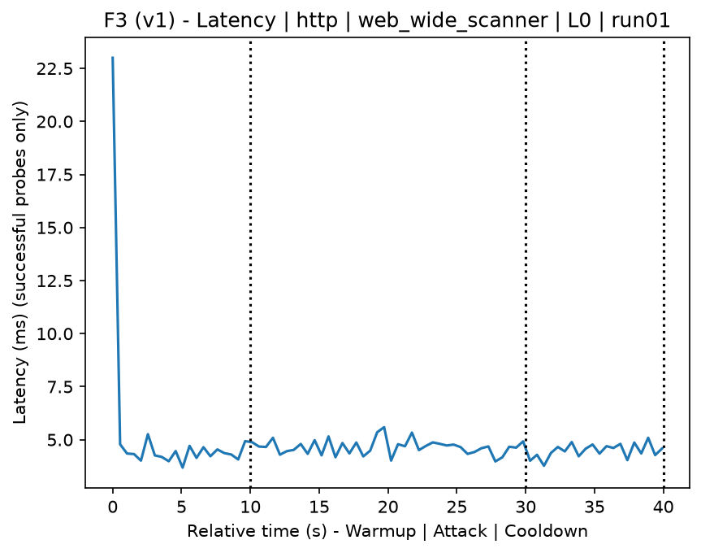
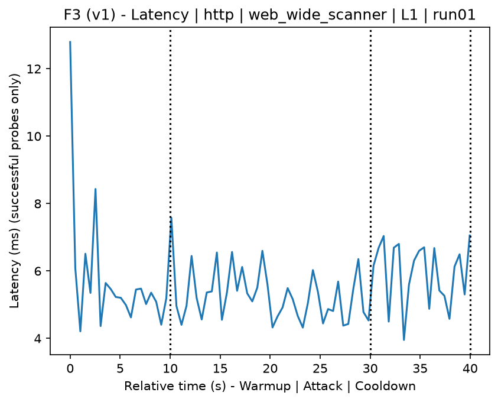
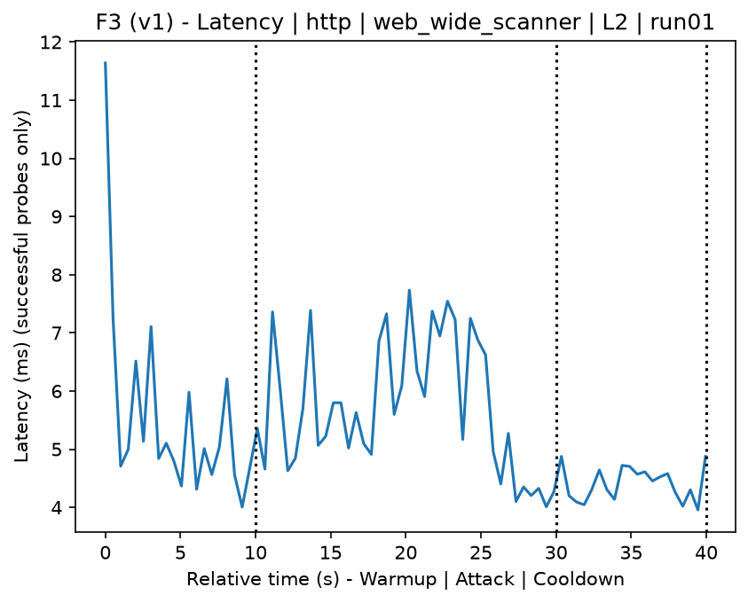
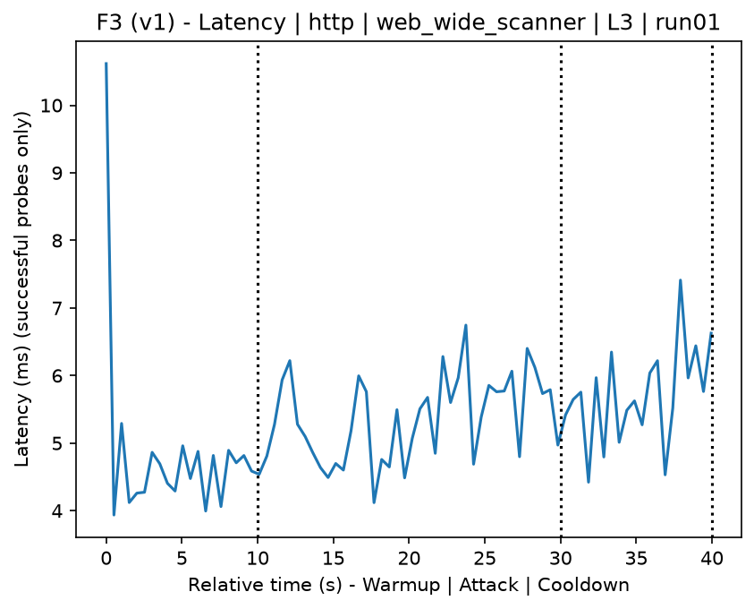
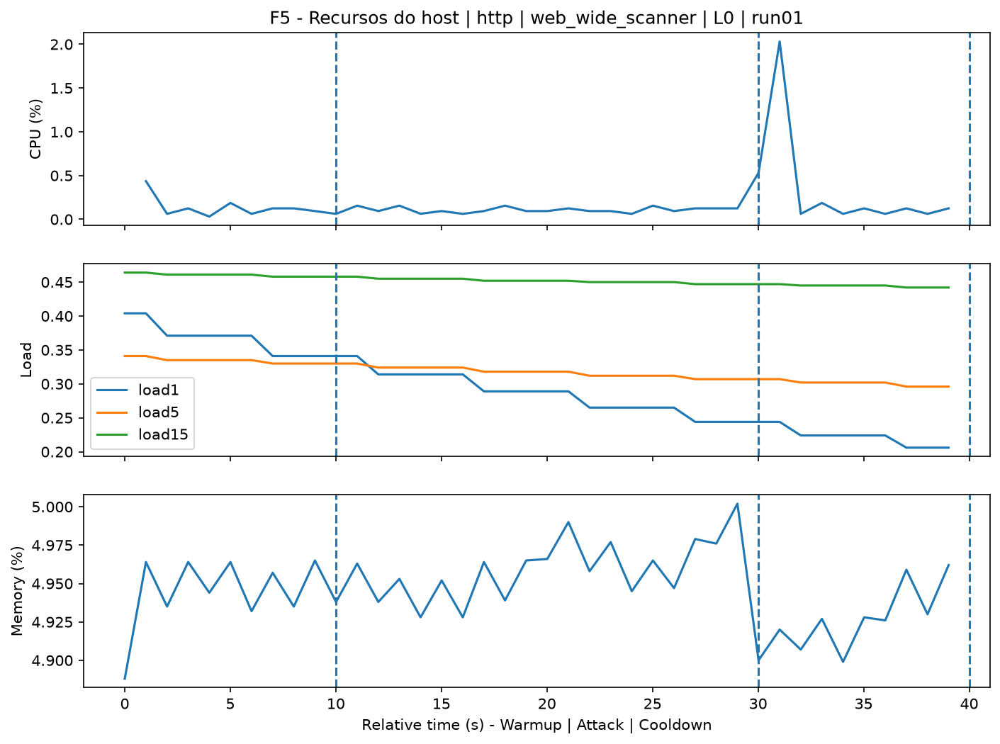
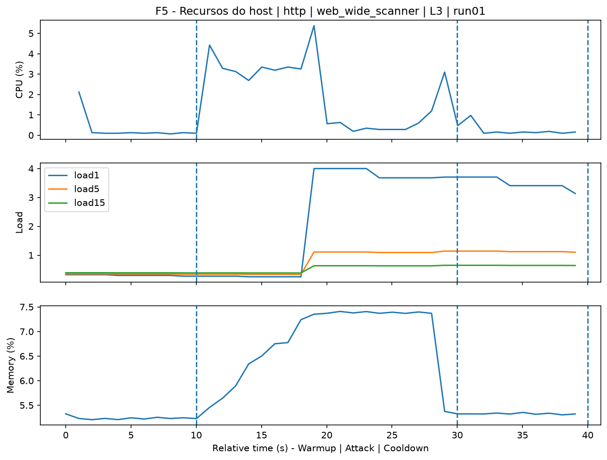
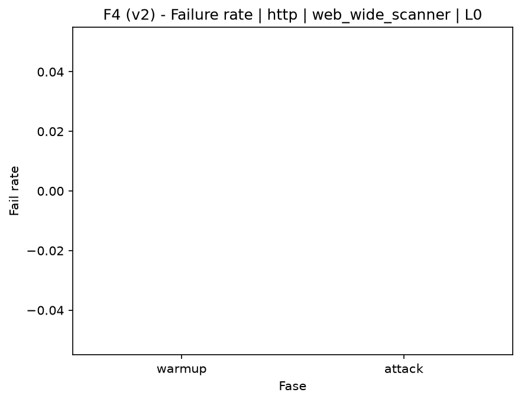

# Web Wide Scanner (`web_wide_scanner`)

[Campaign index](README.md)

This document summarizes the published campaign execution of attack `web_wide_scanner`. In the local catalog, the attack is described as: Broad scanner for known web vulnerabilities. The full execution artifacts are not versioned in this repository; retrieve them from the Figshare dataset linked in the campaign index or regenerate the figures with `run_claim_figures.sh`. The selected figures below are stored under `contrib/assets/campaign_doc`.

## Attack Metadata

| Field | Value |
| --- | --- |
| ID | `web_wide_scanner` |
| Category | 3) Web Application Attacks |
| Subcategory | 3.1 General Web |
| Target services | http-server |
| Image | `attack-web-wide-scanner:latest` |
| Container | `attack-web-wide-scanner` |
| Catalog max runtime | 10 s |
| Intensity parameters | n/a |
| MITRE ATT&CK | [https://attack.mitre.org/tactics/TA0043/](https://attack.mitre.org/tactics/TA0043/) [https://attack.mitre.org/techniques/T1590/](https://attack.mitre.org/techniques/T1590/) [https://attack.mitre.org/techniques/T1592/](https://attack.mitre.org/techniques/T1592/) [https://attack.mitre.org/techniques/T1595/](https://attack.mitre.org/techniques/T1595/) [https://attack.mitre.org/techniques/T1595/002/](https://attack.mitre.org/techniques/T1595/002/) |

## Statistical Summary by Level

| Level | Service | Runs | Attack samples | Mean success | Mean failure | Lat p50/p95 ms | Total PCAP MB | Mean dataset (min-max) | Mean exec s | Extractors ok/total | Mean/max CPU | Mean mem MB |
| --- | --- | --- | --- | --- | --- | --- | --- | --- | --- | --- | --- | --- |
| L0 | http | 5 | 200 | 100% | 0% | 4,82 / 5,68 | 1,67 | 3.160 (3.120-3.200) | 42,25 | 3/3 | 0,7% / 0,77% | 881,73 |
| L1 | http | 5 | 200 | 100% | 0% | 5,16 / 6,71 | 1,66 | 3.136 (3.120-3.160) | 42,2 | 3/3 | 0,79% / 0,94% | 872,76 |
| L2 | http | 5 | 200 | 100% | 0% | 4,65 / 5,93 | 1,67 | 3.160 (3.160-3.162) | 42,09 | 3/3 | 0,73% / 0,87% | 873,32 |
| L3 | http | 5 | 200 | 100% | 0% | 5,11 / 6,66 | 1,66 | 3.144 (3.120-3.160) | 42,19 | 3/3 | 0,78% / 0,94% | 875,56 |

## Stability Across Reruns

| Level | Metric | Runs | Mean | Deviation | CV | Min | Max |
| --- | --- | --- | --- | --- | --- | --- | --- |
| L0 | Mean CPU in attack phase | 5 | 0,7 | 0,04 | 5,15% | 0,67 | 0,76 |
| L0 | Dataset rows | 5 | 3.160,4 | 28,3 | 0,9% | 3.120 | 3.200 |
| L0 | Execution time | 5 | 42,25 | 0,32 | 0,75% | 42,04 | 42,81 |
| L0 | Failure in attack phase | 5 | 0 | 0 | n/a | 0 | 0 |
| L0 | Censored p95 latency | 5 | 5,68 | 0,63 | 11,16% | 5,17 | 6,78 |
| L1 | Mean CPU in attack phase | 5 | 0,79 | 0,07 | 8,84% | 0,67 | 0,84 |
| L1 | Dataset rows | 5 | 3.136 | 21,91 | 0,7% | 3.120 | 3.160 |
| L1 | Execution time | 5 | 42,2 | 0,08 | 0,18% | 42,12 | 42,29 |
| L1 | Failure in attack phase | 5 | 0 | 0 | n/a | 0 | 0 |
| L1 | Censored p95 latency | 5 | 6,71 | 0,92 | 13,78% | 5,33 | 7,89 |
| L2 | Mean CPU in attack phase | 5 | 0,73 | 0,08 | 11,35% | 0,66 | 0,84 |
| L2 | Dataset rows | 5 | 3.160,4 | 0,89 | 0,03% | 3.160 | 3.162 |
| L2 | Execution time | 5 | 42,09 | 0,04 | 0,09% | 42,04 | 42,14 |
| L2 | Failure in attack phase | 5 | 0 | 0 | n/a | 0 | 0 |
| L2 | Censored p95 latency | 5 | 5,93 | 0,92 | 15,55% | 5,09 | 7,39 |
| L3 | Mean CPU in attack phase | 5 | 0,78 | 0,09 | 11,49% | 0,67 | 0,91 |
| L3 | Dataset rows | 5 | 3.144 | 21,91 | 0,7% | 3.120 | 3.160 |
| L3 | Execution time | 5 | 42,19 | 0,07 | 0,16% | 42,13 | 42,27 |
| L3 | Failure in attack phase | 5 | 0 | 0 | n/a | 0 | 0 |
| L3 | Censored p95 latency | 5 | 6,66 | 0,86 | 12,86% | 5,39 | 7,6 |

## Artifact Validation

| Level | Runs | Capture | Probe | Features | Dataset | Resources | Server stats | Acceptance |
| --- | --- | --- | --- | --- | --- | --- | --- | --- |
| L0 | 5 | 5/5 | 5/5 | 5/5 | 5/5 | 5/5 | 5/5 | 5/5 |
| L1 | 5 | 5/5 | 5/5 | 5/5 | 5/5 | 5/5 | 5/5 | 5/5 |
| L2 | 5 | 5/5 | 5/5 | 5/5 | 5/5 | 5/5 | 5/5 | 5/5 |
| L3 | 5 | 5/5 | 5/5 | 5/5 | 5/5 | 5/5 | 5/5 | 5/5 |

## Selected Figures

<table>
<tr>
<td> Time series L0 run01</td>
<td> Time series L1 run01</td>
</tr>
<tr>
<td> Time series L2 run01</td>
<td> Time series L3 run01</td>
</tr>
<tr>
<td> Resources L0 run01</td>
<td> Resources L3 run01</td>
</tr>
<tr>
<td> Failure rate L0</td>
<td> Failure rate L3</td>
</tr>
</table>

## Sources Used

- Attack catalog: `docker/attackers/web-wide-scanner/attack.yaml`
- Full campaign artifacts: available from the Figshare dataset linked in the campaign index; when extracted locally, expected under `experiments/60att_5runs_l0l1l2l3/web_wide_scanner`.
