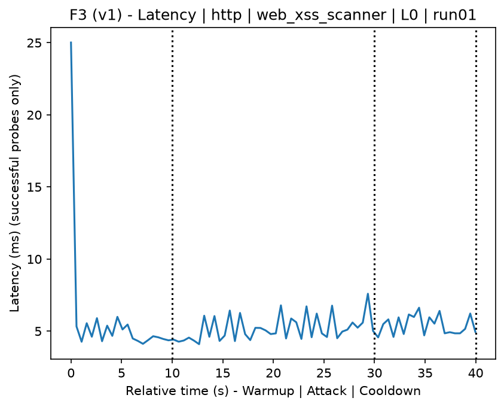
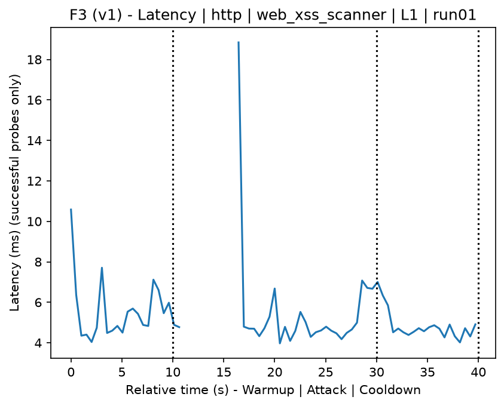
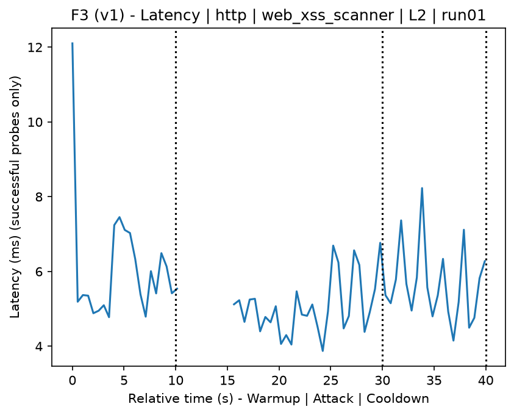
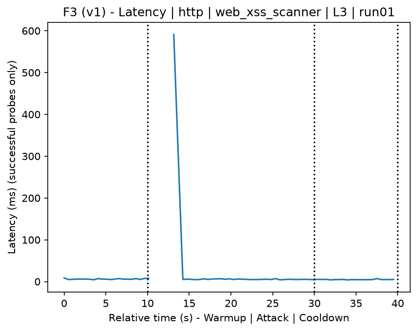
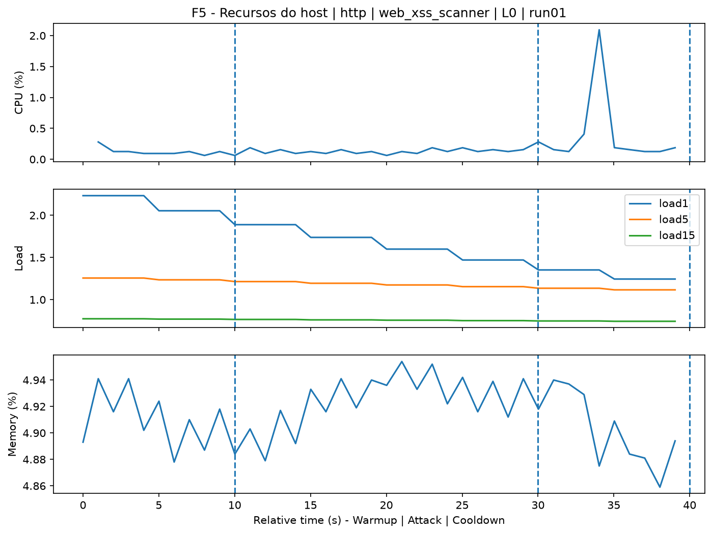
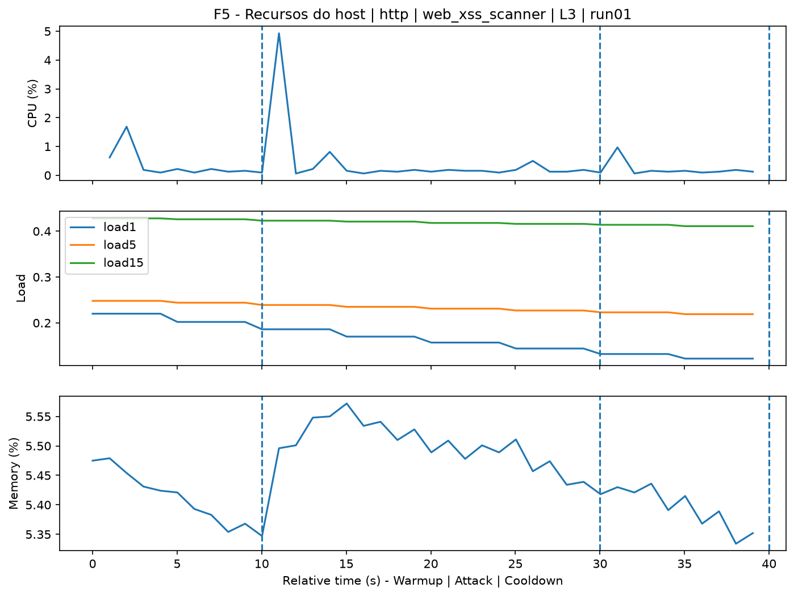
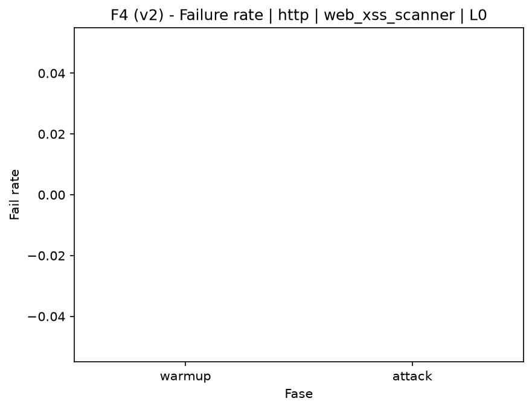
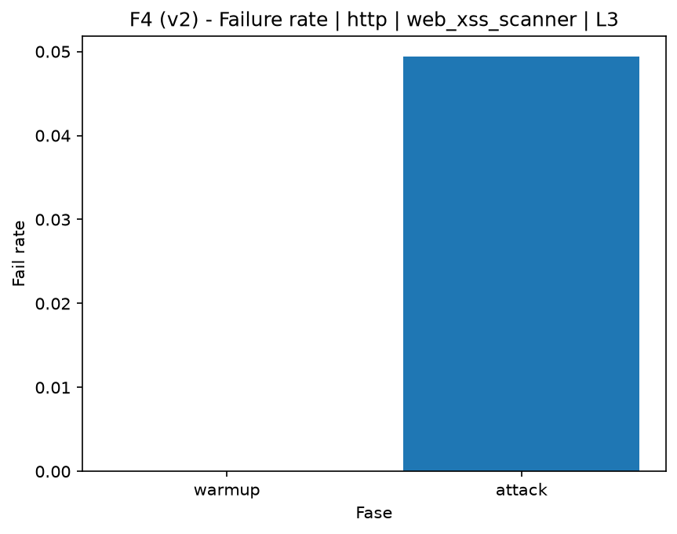

# XSS Scanner (`web_xss_scanner`)

[Campaign index](README.md)

In campaign `experiments/60att_5runs_l0l1l2l3`, this document consolidates the execution of attack `web_xss_scanner`. In the local catalog, the attack is described as: Automated scan and analysis of parameter flaws susceptible to XSS. The documentation below uses only artifacts already present in the repository, mainly the tables and figures from `experiments/60att_5runs_l0l1l2l3/web_xss_scanner`.

## Attack Metadata

| Field | Value |
| --- | --- |
| ID | `web_xss_scanner` |
| Category | 3) Web Application Attacks |
| Subcategory | 3.1 General Web |
| Target services | http-server |
| Image | `attack-xss-scanner:latest` |
| Container | `attack-xss-scanner` |
| Catalog max runtime | 10 s |
| Intensity parameters | n/a |
| MITRE ATT&CK | [https://attack.mitre.org/tactics/TA0043/](https://attack.mitre.org/tactics/TA0043/) [https://attack.mitre.org/tactics/TA0001/](https://attack.mitre.org/tactics/TA0001/) [https://attack.mitre.org/techniques/T1595/](https://attack.mitre.org/techniques/T1595/) [https://attack.mitre.org/techniques/T1595/002/](https://attack.mitre.org/techniques/T1595/002/) [https://attack.mitre.org/techniques/T1190/](https://attack.mitre.org/techniques/T1190/) |

## Statistical Summary by Level

| Level | Service | Runs | Attack samples | Mean success | Mean failure | Lat p50/p95 ms | Total PCAP MB | Mean dataset (min-max) | Mean exec s | Extractors ok/total | Mean/max CPU | Mean mem MB |
| --- | --- | --- | --- | --- | --- | --- | --- | --- | --- | --- | --- | --- |
| L0 | http | 5 | 200 | 100% | 0% | 4,55 / 5,68 | 1,67 | 3.160 (3.160-3.162) | 42,32 | 3/3 | 0,72% / 0,82% | 877,84 |
| L1 | http | 5 | 162 | 95% | 5% | 5,94 / 778,94 | 3 | 4.462 (4.402-4.536) | 42,35 | 3/3 | 4,79% / 27,82% | 935,33 |
| L2 | http | 5 | 160 | 95% | 5% | 5,26 / 781,78 | 3 | 4.470 (4.344-4.584) | 42,37 | 3/3 | 4,65% / 28,12% | 936,21 |
| L3 | http | 5 | 162 | 95% | 5% | 5,61 / 830,31 | 3,01 | 4.487 (4.380-4.626) | 42,36 | 3/3 | 4,63% / 28,92% | 949,55 |

## Stability Across Reruns

| Level | Metric | Runs | Mean | Deviation | CV | Min | Max |
| --- | --- | --- | --- | --- | --- | --- | --- |
| L0 | Mean CPU in attack phase | 5 | 0,72 | 0,07 | 9,4% | 0,65 | 0,83 |
| L0 | Dataset rows | 5 | 3.160,4 | 0,89 | 0,03% | 3.160 | 3.162 |
| L0 | Execution time | 5 | 42,32 | 0,48 | 1,14% | 42,03 | 43,17 |
| L0 | Failure in attack phase | 5 | 0 | 0 | n/a | 0 | 0 |
| L0 | Censored p95 latency | 5 | 5,68 | 0,86 | 15,23% | 4,81 | 6,77 |
| L1 | Mean CPU in attack phase | 5 | 4,79 | 1,14 | 23,86% | 2,77 | 5,47 |
| L1 | Dataset rows | 5 | 4.462 | 67,01 | 1,5% | 4.402 | 4.536 |
| L1 | Execution time | 5 | 42,35 | 0,09 | 0,22% | 42,24 | 42,43 |
| L1 | Failure in attack phase | 5 | 4,98 | 1,83 | 36,65% | 2,94 | 6,45 |
| L1 | Censored p95 latency | 5 | 778,94 | 314,75 | 40,41% | 429,8 | 1.169,58 |
| L2 | Mean CPU in attack phase | 5 | 4,65 | 0,38 | 8,19% | 4,05 | 5,01 |
| L2 | Dataset rows | 5 | 4.470,4 | 106,78 | 2,39% | 4.344 | 4.584 |
| L2 | Execution time | 5 | 42,37 | 0,06 | 0,14% | 42,27 | 42,42 |
| L2 | Failure in attack phase | 5 | 5,03 | 1,77 | 35,29% | 2,86 | 6,45 |
| L2 | Censored p95 latency | 5 | 781,78 | 371,87 | 47,57% | 139,59 | 1.106,24 |
| L3 | Mean CPU in attack phase | 5 | 4,63 | 1,29 | 27,97% | 2,78 | 6,26 |
| L3 | Dataset rows | 5 | 4.487,2 | 100,13 | 2,23% | 4.380 | 4.626 |
| L3 | Execution time | 5 | 42,36 | 0,09 | 0,22% | 42,27 | 42,5 |
| L3 | Failure in attack phase | 5 | 4,99 | 1,83 | 36,62% | 2,86 | 6,45 |
| L3 | Censored p95 latency | 5 | 830,31 | 403,9 | 48,64% | 182,74 | 1.300,69 |

## Artifact Validation

| Level | Runs | Capture | Probe | Features | Dataset | Resources | Server stats | Acceptance |
| --- | --- | --- | --- | --- | --- | --- | --- | --- |
| L0 | 5 | 5/5 | 5/5 | 5/5 | 5/5 | 5/5 | 5/5 | 5/5 |
| L1 | 5 | 5/5 | 5/5 | 5/5 | 5/5 | 5/5 | 5/5 | 5/5 |
| L2 | 5 | 5/5 | 5/5 | 5/5 | 5/5 | 5/5 | 5/5 | 5/5 |
| L3 | 5 | 5/5 | 5/5 | 5/5 | 5/5 | 5/5 | 5/5 | 5/5 |

## Selected Figures

<table>
<tr>
<td> Time series L0 run01</td>
<td> Time series L1 run01</td>
</tr>
<tr>
<td> Time series L2 run01</td>
<td> Time series L3 run01</td>
</tr>
<tr>
<td> Resources L0 run01</td>
<td> Resources L3 run01</td>
</tr>
<tr>
<td> Failure rate L0</td>
<td> Failure rate L3</td>
</tr>
</table>

## Sources Used

- Attack catalog: `docker/attackers/xss-scanner/attack.yaml`
- Campaign artifacts: `experiments/60att_5runs_l0l1l2l3/web_xss_scanner`
